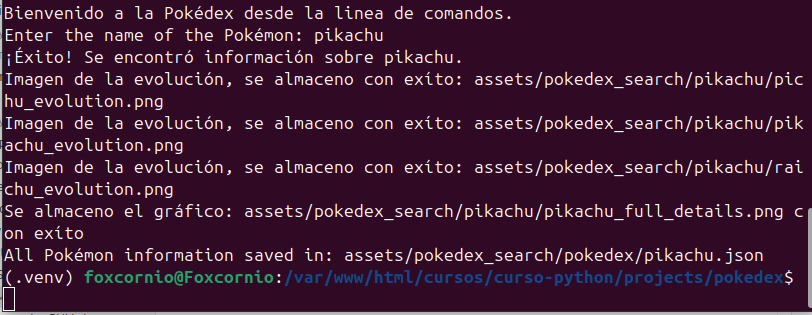

# POKEDEX

> Este proyecto se realizo con ayuda del material que se encuentra en el curso, ademas se tomo como referencia el proyecto del sitio web https://programmerclick.com/article/37062133001/, utiliza diferentes bibliotecas.

## Versión terminal.

> Ubicación : src.terminal.terminal.py<br>Esta versión utiliza las siguientes librerias:

- **os** : Esta librería nos ayuda a ingresar, editar y modificar los directorios.
- **PIL** : La libreria PIL nos ayuda a crear y renderizar las imagenes y textos.
- **matplotlib** : Esta libreria nos ayuda a generar el grafico de radar sobre las estadisticas del personaje.
- **requests** : Esta libreria nos ayuda a hacer las peticiones a la API pokemon, así como trabajar los status code
- **io.BytesIO** : Esta libreria nos ayuda a crear en memoria del programa archivos temporales. La utilizo para poder crear y leer las imagenes y posteriormente guardarlas en el directorio creado con la libreria os.
- **json** : Esta libreria nos ayuda a crear archivos json.

> El proyecto se dividio en 4 archivos, esto con el fin de poder reutilizar el codigo para futuras mejoras.<br>Lo dividi con una estructura de carpetas muy similar a un proyecto web.<br>Tenemos la carpeta **src**, carpeta donde almacenamos las funciones que se subdividen en diferentes directorios, tenemos la carpeta **utils** en esta carpeta se almacenan las funciones que se dedican a realizar las peticiones a la API pokemon **(api.py)**, tambien almacena las funciones que nos ayudan a crear los graficos y las imagenes **(helpers.py)** y por ultimo la funcion que nos ayuda a almacnar la información recolectada en un archivo json **(save_search_json.py)**. Despues tenemos la carpeta **terminal** en esta carpeta va toda la logica de nuestra aplicación, es donde llamamos de forma ordenada a las funciones que contiene utils, para poder generar nuestra imagen estatica. El flujo de ejecución es el siguiente:<br>Solicitamos al usuario que introduzca el nombre de un pokemon, mediante un ciclo while se analizara si el usuario, introdujo o no el nombre, si lo introdujo se llamara a la funcion **fetch_pokemon_data**(se encarga de traer los datos del pokemon, nombre,estadisticas,url de la imagen front,su tipo de pokemon,abilidades,altura,peso y movimientos), si la funcion retorna None(vacío) notificamos al usuario que no se encontro su pokemon e invitamos a que lo intente de nuevo.

```python
while True:
        pokemon_name = input("Enter the name of the Pokémon: ").strip().lower()
        if not pokemon_name:
            print(f"No ingresaste texto, intentalo de nuevo o presiona ctrl+c para salir : {pokemon_name}.")
            continue
        pokemon_data = fetch_pokemon_data(pokemon_name)
        if pokemon_data:
            print(f"¡Éxito! Se encontró información sobre {pokemon_name}.")
            break
        else:
            print(f"No se encontró información sobre el Pokémon: {pokemon_name}. Por favor, inténtalo de nuevo.")
```

> La funcion **fetch_pokemon_data** tiene el siguiente flujo:<br>Recibe como parametro el nombre del pokemon, agregamos el nombre del pokemon en minusculas al final de la url que solicita la información ***https://pokeapi.co/api/v2/pokemon/***, guardamos la respuesta de requests para trabajar con los datos recibidos desde el API, llamamos a su metodo **get** y le pasamos la url creada. Revisamos el status.code de la respuesta que se almaceno en la variable response, si el status code es == a 200, significa que la petición se ejecuto de una manera satisfactoria. Parseamos el contenido de response a un json y lo almacenamos en una nueva variable llamada data. Una vez parseado, retornamos los valores que nos interesa mostrar al usuario, nombre, estadisticas, imagen front, el tipo de pokemon, las habilidades, la altura, el peso y sus movimientos.En caso de que el status.code sea diferente de 200 no retornaremos nada.

```python
def fetch_pokemon_data(pokemon_name):
    """Fetches Pokémon data from the PokéAPI."""
    url = f"https://pokeapi.co/api/v2/pokemon/{pokemon_name.lower()}"
    response = requests.get(url)
    if response.status_code == 200: #Status
        data = response.json()
        return {
            "name": data["name"],
            "stats": {stat["stat"]["name"]: stat["base_stat"] for stat in data["stats"]},
            "image_url": data["sprites"]["front_default"],
            "types": [t["type"]["name"] for t in data["types"]],
            "abilities": [a["ability"]["name"] for a in data["abilities"]],
            "weight": data["weight"] / 10,
            "height": data["height"] / 10,
            "moves": [move["move"]["name"] for move in data["moves"]],
        }
    return None
```

> El proceso comienza cuando la función recibe el nombre del Pokémon (identificado como **_pokemon_name_**). Construimos la URL para la solicitud de la especie del Pokémon, asegurando que el nombre se convierta a minúsculas para que coincida con el formato de la API: ***https://pokeapi.co/api/v2/pokemon-species/{nombre_pokemon}***.<br>Realizamos la primera solicitud HTTP a esta dirección, la función verifica el **_status code_**. Si es **_200_**, la ejecución continúa con el procesamiento de los datos. De lo contrario retornamos una lista vacía. Si la respuesta fue satisfactoria, el cuerpo de la misma se parsea a formato **_JSON_** (**_species_data_**). Extraemos la URL específica de la cadena de evolución que necesitamos para el siguiente paso, la cual se encuentra en **_evolution_chain_**.<br>Una vez obtenida la URL de **_evolution_chain_**, se ejecuta la segunda solicitud HTTP.<br>Se repite la verificación del **_status code_** para esta nueva respuesta. Si es **_200_**, la información se vuelve a parsear a JSON y se almacena en la variable **_evolution_data_**. Despues accedemos la clave **_chain_**. **_Chain_** contiene toda la información de la evolución, donde cada evolución apunta a las siguientes.<br>Para recorrer **_chain_** definimos una función interna y recursiva llamada **_extract_evolutions._** Esta función es la encargada de agregar cada evolución a la lista **_evolutions_**. Extrae el nombre del Pokémon subclave **_species_** dentro del objeto **_chain_**. Luego, construye la URL de su imagen. La URL de la imagen se crea de forma inteligente a partir del ID numérico del Pokémon, el cual se extrae de la URL de su especie. Después de almacenar esta información, la función se llama a sí misma (extract*evolutions) para procesar los elementos contenidos en la subclave \*\*\_evolves_to*\*\*.Devolvemos la lista de evoluciones, conteniendo el nombre y la URL de la imagen de cada Pokémon.

```python
def fetch_evolution_chain(pokemon_name):
    """Fetches the evolution chain of a Pokémon."""
    species_url = f"https://pokeapi.co/api/v2/pokemon-species/{pokemon_name.lower()}"
    species_response = requests.get(species_url)
    if species_response.status_code == 200: #Status
        species_data = species_response.json()
        evolution_chain_url = species_data["evolution_chain"]["url"]
        evolution_response = requests.get(evolution_chain_url)
        if evolution_response.status_code == 200: #Status
            evolution_data = evolution_response.json()
            chain = evolution_data["chain"]
            evolutions = []

            def extract_evolutions(chain):
                evolutions.append({
                    "name": chain["species"]["name"],
                    "image_url": f"https://raw.githubusercontent.com/PokeAPI/sprites/master/sprites/pokemon/other/official-artwork/{chain['species']['url'].split('/')[-2]}.png"
                })
                for evo in chain.get("evolves_to", []):
                    extract_evolutions(evo)

            extract_evolutions(chain)
            return evolutions
    return []
```

> Una ves que adquirimos los datos de las evoluciones, creamos un nuevo directorio con la libreria os, y posteriormente un subdirectorio con el nombre del pokemon que se busco, para crear el subdirectorio utilizaremos el metodo **_path y join_** con estos metodos podremos concatenar el **_output_dir_** y el nombre del pokemon, almacenamos esta nueva ruta en la variable **_pokemon_dir_** y creamos los directorios con el metodo de **_os.mkdirs_**.

```python
output_dir = "assets/pokedex_search"
    os.makedirs(output_dir, exist_ok=True)
    pokemon_dir = os.path.join(output_dir, pokemon_data['name'].lower())
    os.makedirs(pokemon_dir, exist_ok=True)
```

> Una vez creados los directorios comenzaremos a crear las imagenes pero primero los estilos de letra, en mi caso utilizare Confortaa ya que es una fuente legible y moderna.Esta fuente fue descargada googlefonts ***https://fonts.google.com/specimen/Comfortaa***, Utilizaremos nuestra libreria PIL más especificamente el metodo **_ImageFont_** que nos permite cargar tipos de fuentes, en caso de excepción cargaremos la fuente por default.

```python
 try:
        font = ImageFont.truetype("confortaa.ttf", 12)
    except OSError:
        font = ImageFont.load_default()
```

> Ahora crearemos el grafico de las estadisticas con ayuda de nuestra función **_create_radar_graph_**, esta función solicita como parametro las estadisticas del pokemon.Lo que hace internamente es lo siguiente:<br>Llama al metodo **_Figure_** de la libreria **_Matplotlib_** y con el creamos un lienzo en blanco, recibe como parametro, el alto, el ancho y el color, configuramos el lienzo para que se pueda dibujar un grafico de radar, asignamos 111 para decirle a Figure que el grafico se colocara en una cuadricula de 1X1, despues le mencionamos que utilizaromos coordenadas polares. Una vez configurado comenzamos a extraer los datos de **_stats_**, dividimos en 2 listas la primera almacenara los keys y la segunda los values, agregamos a values el primer elemento al final para que se pueda cerrar el circulo. Despues creamos los angulos con ayuda de los **_stats.keys_** que se encuentran en **_labels_** almacenamos en una lista los angulos y con un ciclo for recorremos los labels. Lo que hara el ciclo es que multiplicara por 2radianes ya que 2radianes vienen siendo 360° o un circulo completo, despues volvemos a multiplicar pi, pi lo obtenemos de la libreria **_math_**, y esto nos dara los angulos de cada label.

```python
    fig = Figure(figsize=(4, 4), facecolor="white")
    ax = fig.add_subplot(111, polar=True)


    labels = list(stats.keys())
    values = list(stats.values())
    values += values[:1]  # Close the circle
    angles = [n / float(len(labels)) * 2 * math.pi for n in range(len(labels))]
    angles += angles[:1]
```

> Ya que tenemos los angulos comenzaremos a dibujar los datos con el metodo **_plot_**, que recibe en este caso, los angulos, los valores el ancho de la linea, el estilo de la linea y el color. una vez dibujado vamos a rellenar la figura dibujada con el metodo **_fill_** le pasamos como parametros los angulos los valores, el color y su transparencia.Por ultimo agregaremos el nombre de los labels con la funcion **_set_xticks_** recibe los angulos del 0 al -1, le asignamos los labels con **_set_xticklabels_** este metodo recibe los labels y el olor, agregamos los valores al eje Y con **_set_yticks_** y mostramos en el grafico los mismos valores con **_set_ytickslabels_** que recibe como parametro la lista de labels a mostrar y el color.Por ultimo retornamos la figura(grafico).

```python
    ax.plot(angles, values, linewidth=2, linestyle="dashdot", color="black")
    ax.fill(angles, values, color="orange", alpha=0.4)

    ax.set_xticks(angles[:-1])
    ax.set_xticklabels(labels, color="black")
    ax.set_yticks([20, 40, 60, 80, 100])
    ax.set_yticklabels(["20", "40", "60", "80", "100"], color="black")

    return fig
```

> Almacenaremos el grafico recien creado en la ruta con la subcarpeta anteriormente creada, con el metodo **_savefig_** almacenaremos la imagen del grafico de radar y por ultimo liberamos los recursos utilizados con el metodo **_plt.close_** de nuestra libreria **_matplotlib_**.<br> Una vez almacenado el grafico conseguiremos las imagenes del pokemon y sus evoluciones. para ello utilizaremos la funcion **_fetch_and_resize_image_** esta función tiene el siguiente flujo:<br>Recíbe el url y el tamaño de la imagen en caso de no recibir un tamaño se asigna uno por defecto, realiza una petición requests a la API y retorna una objeto **_Image_** creado en la memoria temporal del programa, con auda de **_ByteIO_**.Si el status code de la solicitud es satisfactorio utilizaremos el metodo **_Image.open()_** dela libreria **_PIL_** pero para poder leer dicha respuesta debemos transformarla a bytes y para ello utilizamos la clase **_BytesIO_** la cual crea de forma temporal la imagen, una vez creado el objeto Image vamos a ridemesionar con las medias recibidas usando el metodo **_resize_** y por ultimo retonamos el objeto **_Image_**.

```python
def fetch_and_resize_image(url, size=(100, 100)):
    response = requests.get(url)
    if response.status_code == 200: #Status
        image_data = Image.open(BytesIO(response.content))
        image_data = image_data.resize(size)
        return image_data
    return None
```

> Una vez que recibimos la imagen la almacenaremos en el subdirectorio creado, agregaremos el nombre de la evolución y el formato de la imagen, en este caso png. Y con el metodo **_save()_** almacenamos la imagen, repetimos el proceso con cada evolución ya que iteramos en nuestro objeto **_evolutions_**. Por ultimo despues de cada iteración notificamos al usuario si la imagen se almaceno con exíto.

```python
  pokemon_image = fetch_and_resize_image(pokemon_data['image_url'], size=(150, 150))
    for evolution in evolutions:
        evo_image = fetch_and_resize_image(evolution['image_url'], size=(100, 100))
        if evo_image:
            evo_image_path = os.path.join(pokemon_dir, f"{evolution['name']}_evolution.png")
            evo_image.save(evo_image_path)
            print(f"Imagen de la evolución, se almaceno con exíto: {evo_image_path}")
```

> Para finalizar creamos la combinación de las imagenes con el grafico, asignamos las medidas del objeto canvas en variables, Creamos un nuevo objeto Image con el metodo **_Image.new()_** el cual recibe como parametro el sistema de color, las medidas y el color de fondo(bg), Una vez que tenemos el objeto **_Image_** dibujaremos sobre el con el metodo **_ImageDraw.draw()_**. Para dibujar encima de nuestro lienzo primero llamamos a abrir nuestro grafico de radar, esto con el metodo **_Image.open()_** en radar\*x asignamos las cordenadas donde ubicaremos el grafico, en este caso lo ubicaremos en el centro en el eje x, despues pegaremos el grafico con el metodo \*\*\*.paste()\_\*\* el cual recibe como parametro el grafico y su coordenada en X y Y.

```python
        radar_graph_image = Image.open(radar_graph_path)
        radar_x = (canvas_width - radar_graph_image.width) // 2
        combined_image.paste(radar_graph_image, (radar_x, 20))
```

> Despues vamos a dibujar el texto, asignamos un valor al eje Y, este valor va a determinar la altura a la que se miraran los textos, agregamos los textos con el metodo **_draw.text()_** y por ultimo agregaremos las imagenes de los pokemones, de la misma forma que se agrego el grafico, para que las evoluciones no aparezcan sobrepuestas se agrego una medida de separacion que se sumara al eje Y despues de cada iteración que se realice sobre nuestra lista evolution, el proceso de dibujado sera el mismo que se sigio con el grafico de radar, se abre la imagen se modifica el path, se abre la imagen, se asigna la cordenada x, despues se pega con el metodo **_paste()_** y este metodo recibe el objeto Image, la cordenada X, Y.<br>En caso de no encontrar la imagen o ocurrir alguna excepción el usuario sera notificado con un mensaje.

```python
if pokemon_image:
            combined_image.paste(pokemon_image, (0, 50))
            current_y = EVOLUTION_START_Y
            for i, evolution in enumerate(evolutions):
                if evolution['name'] != pokemon:
                    try:
                        evo_filename = f"{evolution['name'].lower()}_evolution.png"
                        evo_path = f"{output_dir}/{pokemon_data['name'].lower()}/{evo_filename}"
                        evo_image = Image.open(evo_path)

                        image_evo_x = canvas_width - evo_image.width - 20

                        combined_image.paste(evo_image, (image_evo_x, current_y))

                        current_y += Y_OFFSET_PER_EVOLUTION

                    except FileNotFoundError:
                        print(f"Advertencia: No se encontro la imagen de la evolución {evo_path}")
                    except Exception as e:
                        print(f"Ocurrio un error mientras se procesaba {evolution['name']}: {e}")
```

> Para finalizar vamos a guardar el objeto **_Image_** que combinamos con el grafico, la información y las evoluciones en el subdirectorio, ademas almacenaremoslos todos los datos que solicitamos a la API en un archivo JSON, para hacerlo llamaremos a nuestra funcion **_save_pokemon_data_as_json_**. Esta funcion funciona de la siguiente forma:<br>Recibe 2 parametros la información que se transformara en json y la ubicación donde se almacenara el json, primero vamos a crear el directorio pokedex, con ayuda de **_os.path.join_**, si el directorio no existe lo creamos, despues le asgnaremos nombre al archivo con el nombre del pokemon, por ultimo abrimos un archivo temporal de escritura el cual recibe como parametro el archivo path, con **_json.dump()_** el archivo se almacenaraen el path y la funcion **_jump()_** recibe la informacion , el tipo de archivo a crear identación y el sistema ascii, una vez creado el archivo se notificara al usuario que su información buscada se almaceno con exíto.

```python
def save_pokemon_data_as_json(pokemon_data, output_dir):
    pokedex_dir = os.path.join(output_dir, "pokedex")
    os.makedirs(pokedex_dir, exist_ok=True)

    pokemon_json_path = os.path.join(pokedex_dir, f"{pokemon_data['name'].lower()}.json")

    with open(pokemon_json_path, "w", encoding="utf-8") as json_file:
        json.dump(pokemon_data, json_file, ensure_ascii=False, indent=4)

    print(f"All Pokémon information saved in: {pokemon_json_path}")
```

### Ejecución del programa en terminal:

> En este ejemplo se busco al pokemon pikachu desde la terminal.
> 
> El resultado fue el siguiente:
>  > [Abrir JSON de pikachu](assets/pokedex_search/pokedex/pikachu.json)

## Versión GUI.

> Ubicación : src.gui.main_window.py<br>Esta versión utiliza las siguientes librerias:

### Instrucciones.

> El usuario debe introducir el nombre del pokemón.<br>Debe mostrar una imagen y las estadisticas.<br>Las estadisticas deben contener:

1. Peso [x]
2. Tamaño [x]
3. Movimientos [x]
4. Habilidades [x]
5. Tipos [x]

> Se debera guardar la información en un json dentro de una carpeta llamada pokedex.<br>Terminado se debera subir el codigo a github donde se explicaran los siguientes puntos:

1. Como lo realizaste.
2. Que bibliotecas se necesitan, para que otro usuario pueda ejecutar el proyecto.
3. Mostrando imagenes de muestra de algun resultado.
4. Describir que has aprendido en este curso.

### Objetivos

- Aprenderá a consumir una API web pública con la librería requests.
- Dominará la gestión de códigos de status de una API así como el manejo de los resultados.
- Será capaz de crear un archivo dentro del sistema operativo y guardar información en él.
- Arenderá un poco del mundo Pokémon.

### Requisitos:

- El proyecto debe realizarse de forma individual.
- Los participantes deben entregar el link de su repositorio público de GitHub donde en el README.md detallen cómo lo hicieron, qué bibliotecas necesitaría otro usuario para ejecutar el proyecto, mostrando imágenes de muestra de algún resultado de búsqueda de un pokémon y describiendo qué han aprendido en este módulo.

### Entregables

> Los participantes deberán entregar un repositorio de su código en GitHub con los siguientes archivos:

- README.md : Donde explicarán su proyecto y lo que han aprendido como previamente se mencionó.
- Archivo .py: El código funcional comentado de su proyecto.
- Carpeta “pokedex”: Una carpeta con un archivo .json adentro para demostrar que han podido guardar información en un archivo con éxito.
